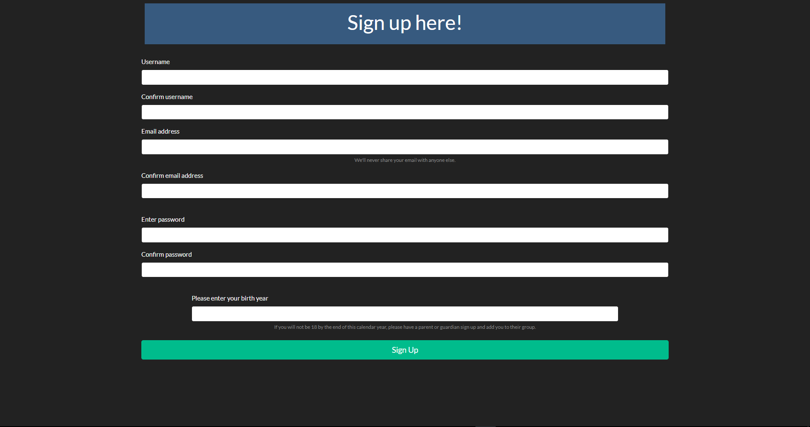

  
  #  Project Title
     Routinify
    
  ##  Description
    We help you make a list of things you need to do around the house.
  ## Table of Contents
  * [Description](#description)
  * [Installation](#Installation)
  * [License](#license)
  * [Contribution](#contribution)
  * [Facesoftheteam](#Facesoftheteam)
  * [Dependencies](#Dependencies)
  * [License](#License)
  * [Images](#Images)
  * [Questions](#questions)
  * [Links](#Links)
  ## Installation
  To install dependencies, run the below command : npm install, install mysql2, bcryptjs, express, express-handlebars,
  express-session, nodemon, passport, passport-local, sequelize.
    
  ## Dependencies
    bcryptsjs   
    express 
    express-handlebars  
    express-session 
    mysql2  
    nodemon 
    passport    
    passport-local  
    sequelize.
  ## License
 

  ## Images
  
  
  
  
  
     
  ## Contribution
     Keaton-Brewster, Eliaswolfgang, Justin Yates, Maggiemaywilder, Michael.
     
  ## Faces of the team
  
  
  
  
  

     
  ## Questions
   If you have any questions reach us at
   Github :     
   [Keaton-Brewster](https://github.com/Keaton-Brewster/project-2)  
   [Ian E Von Fange](https://github.com/eliaswolfgang)  
   [Justin Yates](https://github.com/justinyates887)    
   [Maggie May Wilder](https://github.com/maggiemaywilder)  
   [Michael Swigart](https://github.com/Michaelswigart) 
  
  ## Links
